# Extreme V3 Integrated Frame Pipeline：完整用例规格

> 文档属性：出题方内部规格。本文包含隐藏 seed、性能门槛和参考解校准信息，
> 不应放入被测模型获得的 `workspace.zip`。公开任务说明以
> `challenges/nav_rollback/task/TASK_PROMPT.md` 为准。

## 1. 用例定位

本用例用于比较不同模型在相同 Agent 框架下完成游戏性能优化长任务的能力。
它不是完整游戏引擎，也不包含渲染器、GPU、资源加载、网络服务或 UE 源码；
而是一个 C++20、单进程、确定性、无渲染的游戏服务器主循环。所有主要负载都
位于同一帧依赖链中，并通过可观察状态、稳定顺序、摘要和回滚相互耦合。

用例要求被测模型自主完成完整闭环：

1. 构建并运行项目；
2. 使用 Perfetto SDK 添加有效打点；
3. 采集并用 PerfettoSQL 分析真实性能数据；
4. 根据证据定位瓶颈；
5. 做四轮保持语义的优化；
6. 每轮重新验证、采集和比较；
7. 留下可由代码独立验证的九份 trace、分析结论和来源证明；
8. 接受隐藏语义用例和独立外部计时。

设计目标不是考察某个固定算法，而是同时考察代码理解、性能分析、数据结构
设计、时序状态维护、跨系统正确性和长任务执行纪律。目标经验通过率为
10%–30%，发布验收上限为低于 50%。通过率必须通过多模型 pilot 实测，不能
仅从源码复杂度推断。

## 2. 技术选型与发布形态

| 项目 | 当前实现 |
|---|---|
| 语言标准 | C++20 |
| 构建系统 | CMake 3.20+；可使用 Ninja |
| 运行模型 | 单进程、CPU、确定性主循环 |
| 渲染 | 无 |
| Profile | Perfetto SDK，进程内 Track Event backend |
| Trace 分析 | 随包提供的 `trace_processor_shell` 和 PerfettoSQL |
| Agent 辅助脚本 | Python 3，入口 `scripts/lb.py` |
| 隐藏评测 | 独立 Python Code Grade，重新构建原始基线和候选代码 |
| 发布目标 | Linux amd64 |
| 任务 ID | `extreme_frame_pipeline_longbench_v3` |
| 运行结果 schema | `longbench.run.v3` |
| findings schema | `longbench.findings.v3` |
| comparison schema | `longbench.comparison.v3` |

发布包中注入固定版本的 `perfetto.h`、`perfetto.cc`、SDK 版本文件和目标平台
trace processor。候选不需要联网，也不应新增网络或运行时依赖。

项目有两种构建模式：

- Release：`LONGBENCH_ENABLE_PERFETTO=OFF`，供语义验证和隐藏性能计时；
- Profile：`LONGBENCH_ENABLE_PERFETTO=ON`，使用 `RelWithDebInfo` 采集 trace。

`LONGBENCH_SOURCE_HASH` 在构建时写入 trace 的 `RunMetadata`，将每份 profile
与当时的 `CMakeLists.txt`、`include/`、`src/` 内容绑定。

## 3. 项目组成

| 路径 | 职责 |
|---|---|
| `CMakeLists.txt` | C++20、Perfetto 开关、源码哈希和目标定义 |
| `include/longbench/config.hpp` | 全部运行参数和默认 mixed 配置 |
| `include/longbench/world.hpp` | Grid、Unit、Transform、Collider 和 World 状态 |
| `src/main.cpp` | 场景预设、CLI、边界检查和 JSON 输出 |
| `src/main_loop.cpp` | 帧顺序、warmup、计时、checkpoint 和 rollback |
| `src/navigation.cpp` | 加权网格寻路 |
| `src/systems.cpp` | 输入编辑、人口更新和帧摘要 |
| `src/component_queries.cpp` | ECS 重叠查询和结构变更后的副作用 |
| `src/transforms.cpp` | 定点数层级 Transform 传播 |
| `src/collision.cpp` | AABB broad-phase 基线和规范化碰撞对 |
| `src/interest.cpp` | replication interest、enter/leave/stay delta |
| `src/events.cpp` | 有序事件构造、payload 和 dispatch |
| `src/history.cpp` | 环形快照、恢复和保留内存统计 |
| `src/profile.cpp` | Perfetto 会话、32 MiB buffer 和 trace 落盘 |
| `scripts/lb.py` | doctor、构建、profile、report、verify、findings、compare |
| `queries/*.sql` | Frame 和 Zone 汇总查询 |
| `task/TASK_PROMPT.md` | 给被测模型的公开任务说明 |
| `grader/test_by_code.py` | 出题方隐藏评分器源码 |
| `authoring/package_dsbench.py` | 生成 workspace、隐藏附件和上传 manifest |
| `authoring/analyze_pilot.py` | 汇总多模型 pilot 的通过率和分数分布 |

## 4. 世界状态与确定性

### 4.1 核心状态

`Unit` 包含 ID、网格位置、目标槽、flags、八位有效 component mask、health、
energy、cooldown、inventory digest 和 behavior state。component mask 的低两位
同时承担 team 语义，因此 ECS 结构变更也会影响 interest management。

`Grid` 保存宽高、terrain cost、blocked 标记和 revision。`TransformNode` 保存
本地及世界 2×2 矩阵与二维位移，定点缩放常量为 1024。父节点索引始终小于
子节点索引，根节点使用 `0xffffffff`。`Collider` 引用 transform，并保存 half
extent、layer 和 mask。

`World` 还保存 observer 的上一帧可见集合，以及 simulation、route、rollback、
transform、collision、event、query、interest 八类摘要和三类计数。

### 4.2 初始化

世界由 seed 驱动的 SplitMix64 风格序列确定性生成：

- terrain cost 为 1–4；
- blocked 初始概率约 9%；
- goal 唯一且强制可通行；
- navigator 初始位置强制不在 blocked cell；
- unit ID 与 vector index 一致；
- component mask 至少包含 bit 0；
- transform 按 ID 建树，每 4096 个节点产生一个根；
- collider 通过固定乘法散列映射到 transform，并产生 layer/mask。

相同源码、seed 和参数必须生成完全一致的可观察结果。候选可以增加
implementation-only cache/index，但这些结构不能改变语义，且必须在结构变更
和 rollback 后正确修复或失效。

## 5. 主循环与跨系统依赖

每个 warmup 帧和 measured 帧都执行同一 `run_frame`。计时 JSON 中的
`measured_ns` 只覆盖 measured 帧；Perfetto trace 中的 `Frame` 总时长包含
warmup 与 measured 帧。隐藏性能评分使用整个子进程的外部 wall-clock，不使用
候选自行报告的时间字段。

```mermaid
flowchart LR
    A["Input：地图、目标、Transform、结构与位置变更"] --> B["Navigation"]
    B --> C["Population update"]
    C --> D["Component queries"]
    D --> E["Transform propagation"]
    E --> F["Collision pairs"]
    F --> G["Interest sets and deltas"]
    G --> H["Ordered events"]
    H --> I["Finalize digest"]
    I --> J["Record snapshot"]
    J --> K{"Rollback due?"}
    K -->|yes| L["Restore temporal state and update rollback digest"]
    K -->|no| M["Advance tick and emit counters"]
    L --> M
    D -. "component mask/team" .-> G
    F -. "pair count" .-> H
    D -. "match count" .-> H
    G -. "visible count" .-> H
```



系统顺序是语义的一部分。将多个系统并行化或重排，若改变整数运算、匹配顺序、
事件 seed、摘要或 rollback 后状态，即判为错误。

### 5.1 Input 与 population

- 每到 `edit_period`，按固定序列切换若干 blocked cell，跳过 goal，并递增
  grid revision；
- 每 13 帧在固定相位改变最多七个 navigator 的 goal slot；
- 每帧修改后半段 transform 的 local position，部分修改 local scale；
- 到 `reparent_period - 1` 相位时重设一个节点父级，仍保持父索引小于子索引；
- 每帧对 unit component mask 切换若干 bit，mask 不能变成零；
- 每帧移动若干非 navigator unit，形成 interest churn；
- population update 修改采样 unit 的 health、cooldown、inventory 和 behavior。

这些变更发生在所有主要系统之前，专门考察 cache invalidation、结构索引维护和
dirty state 传播。

### 5.2 Weighted navigation

基线为每个 navigator 单独从 goal 反向运行 Dijkstra，再从 start 选择第一步。
边权来自进入 cell 的 terrain cost。相同成本时的邻居顺序固定为
`up → left → right → down`，这是输出契约。

主要考察：重复寻路消除、按 goal/revision 共享 reverse field、地图编辑后的精确
失效、goal 切换和不可达处理。参考优化使用共享反向路由场，但任何保持结果的
方案均可。

### 5.3 ECS component-query churn

每个查询需要三个 component bit，并排除一个不同 bit。查询描述每三个 tick
变化一次，相互重叠，operation 为 energy、cooldown 或 behavior 三类之一。

基线对每个 query 扫描全部 unit，按 unit index 收集临时 match vector，再严格
按 query sequence 和 unit ID 顺序执行副作用。因此重新排列查询或匹配项会改变
后续查询输入和摘要。

主要考察：bitset/archetype/index、重叠查询、稀疏结构更新、稳定枚举顺序，以及
rollback 恢复旧 mask 后的索引重建或版本化。

### 5.4 Dirty Transform

基线每帧按 ID 顺序重算全部 transform。根节点直接复制 local 值；子节点按
固定 1024 缩放执行父子矩阵和位移组合，使用整数除法。帧摘要按固定公式抽样
最多 32 个节点。

主要考察：精确 dirty propagation、祖先变更、reparent 后子树失效、缓存布局和
保持定点组合顺序。仅标记直接修改节点而不传播后代会在隐藏语义用例中失败。

### 5.5 Broad-phase collision

基线枚举全部 `left < right` collider 对，为每个 collider 从 world transform
计算 AABB。只有双方 layer/mask 互相允许且 inclusive AABB 相交才产生碰撞：
边界接触也算 overlap。输出对必须保持规范 `(low, high)` 顺序，整帧摘要严格按
该顺序累计。

主要考察：从 O(N²) broad phase 转为 sweep-and-prune、grid 或其他空间索引，
同时去重、保留稳定全局 pair order，并正确响应 dirty transform。

### 5.6 Replication interest management

每个 observer slot 在每帧通过固定公式选择 observer unit。可见目标必须：

- 不是 observer 自身；
- `component_mask & 3` 与 observer 相同；
- Manhattan distance 不大于 radius。

基线为每个 observer 扫描全部 unit。visible ID 由扫描顺序自然保持升序，再与该
slot 的 `previous_interest` 做双指针合并，产生按 ID 排序的 leave、enter、stay
编码。delta 会修改 observer behavior，新的 visible 集合成为下一帧状态。

主要考察：team-aware spatial index、稀疏移动、canonical order、delta 语义和
rollback 对 previous-interest temporal state 的恢复。

### 5.7 Ordered event allocation/dispatch

每帧事件数为 `min(events_per_frame, units × 8)`。事件随机值同时依赖 seed、tick、
collision pair count、query match count 和 interest visible count，因此前序系统
错误会传播到事件结果。

基线为每个事件进行一次多态堆分配，并分配 16–63 字节 payload；然后严格按生产
顺序 dispatch。三种事件分别修改 health、cooldown/energy 或 flags/inventory，
payload 内容参与摘要。

主要考察：packed event、arena/SoA、减少 allocation 与 virtual dispatch，同时
保持生产顺序、payload 哈希和目标副作用完全一致。

### 5.8 Snapshot history 与 rollback

基线环形历史每帧完整复制以下状态：

- units；
- transforms 的 local/world 状态和 parent；
- blocked grid 与 grid revision；
- previous-interest sets；
- simulation、route、transform、collision、event、query、interest 摘要；
- collision/query/interest 计数。

快照在 finalize 后记录到 `source_tick % capacity`。当
`tick >= rollback_depth` 且
`tick % rollback_period == rollback_period - 1` 时，恢复
`tick - rollback_depth`。恢复后基于 restored dynamic hash 更新独立的
rollback digest。rollback digest 本身不随普通快照回退。

主要考察：copy amplification、稀疏/全量自适应快照、ring wrap、状态所有权、
跨系统恢复和 implementation-only index 的安全重建。

## 6. 可观察语义与输出

程序始终输出一个 `longbench.run.v3` JSON。隐藏评测不会信任候选报告的耗时，
但会逐字段比对以下 19 个语义和维度字段：

1. `checksum`；
2. `route_digest`；
3. `rollback_digest`；
4. `transform_digest`；
5. `collision_digest`；
6. `event_digest`；
7. `query_digest`；
8. `interest_digest`；
9. `collision_pair_count`；
10. `query_match_count`；
11. `interest_visible_count`；
12. `units`；
13. `navigators`；
14. `frames`；
15. `transforms`；
16. `colliders`；
17. `events_per_frame`；
18. `component_queries`；
19. `interest_observers`。

JSON 还报告 `measured_ns`、`frame_p50_ns`、`frame_p95_ns`、`frame_p99_ns` 和
`retained_history_bytes`，供候选诊断，不作为隐藏性能真值。

最终 `checksum` 哈希完整 dynamic state、tick、rollback digest、terrain、goals 和
colliders。dynamic hash 覆盖 unit 全字段、blocked grid、previous-interest 全量
内容、transform local/world 全字段及各系统 digest/count。

## 7. CLI、边界与公开场景

主要 CLI：

```text
--scenario mixed|raid|history|churn|scene|events|ecs|interest
--seed --units --navigators --grid-width --grid-height --goals
--warmup --frames --history-capacity --rollback-period --rollback-depth
--edit-period --edits --mutations
--transforms --colliders --transform-mutations --reparent-period
--events --component-queries --structural-changes
--interest-observers --interest-radius --interest-movements
--trace --output --quiet
```

合法性约束包括：units 1–500000、grid 每维 2–512、transform 1–500000、
collider 不超过 transform 且不超过 30000、events 不超过 250000、query 不超过
128、结构变更/observer/interest movement 不超过 unit 数、radius 不超过网格
宽高之和、measured frame 非零。`history_capacity=0` 时 rollback period/depth
必须同时为零；启用 history 时 capacity 必须大于 rollback depth。

下表按“数量/相关数量”压缩展示场景预设。列含义见表头。

| 场景 | U/N | grid/G | warm/measured | history cap/period/depth | edit period/count | pop mut | transform count/mut/reparent | colliders | events | query count/struct | interest obs/radius/move |
|---|---:|---:|---:|---:|---:|---:|---:|---:|---:|---:|---:|
| mixed | 60000/250 | 44x44/6 | 4/42 | 28/11/7 | 9/3 | 420 | 16000/40/17 | 2400 | 10000 | 12/120 | 24/4/90 |
| raid | 12000/420 | 46x46/5 | 3/28 | 16/13/7 | 9/2 | 160 | 3000/8/19 | 500 | 1200 | 4/40 | 8/4/30 |
| history | 120000/24 | 34x34/4 | 3/56 | 32/9/6 | 14/1 | 320 | 40000/64/13 | 300 | 1000 | 2/200 | 4/3/80 |
| churn | 30000/240 | 42x42/12 | 3/36 | 20/10/5 | 2/4 | 500 | 12000/80/3 | 1400 | 5000 | 20/1200 | 40/6/900 |
| scene | 12000/20 | 32x32/4 | 3/22 | 16/9/5 | 11/1 | 80 | 60000/35/7 | 5500 | 1500 | 3/60 | 10/4/40 |
| events | 30000/8 | 24x24/3 | 3/28 | 18/10/6 | 15/1 | 120 | 3000/5/23 | 300 | 35000 | 2/80 | 4/3/50 |
| ecs | 140000/0 | 48x48/3 | 3/28 | 0/0/0 | 0/0 | 120 | 100/0/0 | 0 | 0 | 44/1600 | 0/0/0 |
| interest | 90000/40 | 72x72/5 | 3/22 | 18/9/5 | 13/1 | 120 | 200/0/0 | 0 | 200 | 2/600 | 80/7/2400 |

CLI 中显式提供的参数覆盖 scenario 预设，因此隐藏评测全部使用 `mixed` 入口加
完整参数向量，避免模型只针对场景名称写分支。

## 8. Perfetto 打点和分析工具

Perfetto 使用三个 category：

- `longbench.frame`：顶层 `Frame`；
- `longbench.system`：内建 coarse zone 与候选新增 zone；
- `longbench.counter`：计数器和 `RunMetadata`。

初始代码只有 `Frame`、`Input`、`Update`、`Checkpoint` 四个 coarse zone。每帧还
输出 Units、GridRevision、HistoryBytes、Transforms、CollisionPairs、Events、
QueryMatches 和 InterestVisible counter。候选需要在真实瓶颈源码中保留新增的
`LB_ZONE`，不能只在 trace 外伪造报告。

Perfetto session 使用 32 MiB buffer 和 in-process backend。随包 SQL 提供：

- `zone_summary.sql`：按 zone 统计 calls、total/avg/max ms；
- `frame_summary.sql`：统计 Frame count、avg、p95、max ms。

常用命令：

```text
python scripts/lb.py doctor
python scripts/lb.py build --release
python scripts/lb.py build --profile
python scripts/lb.py profile --tag baseline --scenario mixed
python scripts/lb.py report artifacts/baseline/profile.pftrace
python scripts/lb.py verify
python scripts/lb.py submit-analysis task/findings.json
python scripts/lb.py compare baseline checkpoint_primary checkpoint_state checkpoint_scale optimized
```

每次 `profile` 生成：

```text
artifacts/<tag>/profile.pftrace
artifacts/<tag>/run.json
artifacts/<tag>/report.json
artifacts/<tag>/manifest.json
```

manifest 记录 UTC 时间、命令、source hash、binary hash、trace hash、result hash、
文件大小和场景。隐藏评测重新计算这些值，并从原始 trace 查询真实 zone、指标与
内嵌 source hash。

## 9. 被测模型必须完成的九阶段证据链

| 顺序 | tag | 要求 |
|---:|---|---|
| 1 | `baseline` | 修改语义前；必须绑定原始 logic hash；含四个 coarse zone |
| 2 | `diagnostic_primary` | 新 source hash；至少 2 个 live marker |
| 3 | `checkpoint_primary` | 再次新 hash；精确 checksum；相对 baseline 原始 Frame ≥1.04x |
| 4 | `diagnostic_state` | 新 hash；至少 4 个累计 marker，且新增至少 2 个 |
| 5 | `checkpoint_state` | 新 hash；相对 checkpoint_primary ≥1.04x |
| 6 | `diagnostic_scale` | 新 hash；至少 6 个累计 marker，且新增至少 2 个 |
| 7 | `checkpoint_scale` | 新 hash；相对 checkpoint_state ≥1.04x |
| 8 | `diagnostic_tail` | 新 hash；至少 8 个累计 marker，且新增至少 2 个 |
| 9 | `optimized` | 绑定最终 logic hash；至少 8 marker；相对 checkpoint_scale ≥1.04x |

这里的阶段增益来自 Perfetto trace 中全部 `Frame` slice 的总时长。九个 source
hash、trace hash 必须全部不同，manifest 时间必须单调，且九份 run checksum
一致。仅改注释/空白虽然会改变 source hash，但不能满足 1.04x 实测增益。

`compare` 只使用五个 checkpoint 的 `run.json.measured_ns` 生成四段和端到端
speedup；grader 另外用原始 trace 验证每段 1.04x，因此不能通过篡改 compare
JSON 或候选计时字段获得工作流分。

## 10. Findings 产物

`findings.json` 必须有 4–8 个按 `rank=1..N` 排列的条目，并覆盖：

| phase | 必须引用的 trace |
|---|---|
| `primary` | `diagnostic_primary` |
| `state` | `diagnostic_state` |
| `scale` | `diagnostic_scale` |
| `tail` | `diagnostic_tail` |

每项还必须包含：

- workspace 内安全相对路径 `source.file`；
- 当前文件中真实存在的 `source.symbol`；
- 合法 `root_cause`；
- 至少一个引用该阶段 live zone 的 evidence；
- evidence metric 为 `calls`、`total_ms`、`avg_ms`、`max_ms` 之一；
- 数值与 trace processor 查询值一致；
- 非空 `proposed_change`。

合法 root cause 为：`repeated_search`、`redundant_work`、`allocation`、
`poor_locality`、`copy_amplification`、`cache_invalidation`、`serialization`、
`branching`、`dirty_propagation`、`pair_generation`、`event_churn`、
`temporal_state`、`component_query`、`structural_churn`、
`interest_management`、`spatial_index`。

`calls` 容差为 0.1；时间类 metric 容差为 `max(0.25 ms, |actual| × 15%)`。

## 11. 公开语义验证

`python scripts/lb.py verify` 构建 Release，并把以下七个固定用例各运行两次：

| 用例 | 主要覆盖 |
|---|---|
| `micro` | 小规模全管线 |
| `wrap` | history ring wrap 与 rollback |
| `churn` | 高频 edit、reparent、结构与位置 churn |
| `no_rollback` | 启用 history 但不触发 rollback |
| `population` | 无 navigation 的人口、query、interest 状态 |
| `query_order` | 重叠 query 的稳定顺序和副作用 |
| `interest_rollback` | interest delta 与 rollback 组合 |

每个用例验证两次输出确定性，并与源码内固定 oracle 比较 checksum、七类系统
digest 及 collision/query/interest 三类计数。公开 verify 是快速反馈，不替代
隐藏 seed、边界分布和外部计时。

## 12. 隐藏评测执行过程

1. 读取隐藏 `grader_config.json`；
2. 校验 `baseline_source.zip` SHA-256；
3. 安全解压基线，并校验原始 logic hash；
4. 分别以 CMake Release、Perfetto OFF 构建基线与候选；
5. 执行 13 个隐藏语义用例，逐项比较 19 个字段；
6. 对 13 个性能用例先做一次正确性比较；
7. 每个性能用例再运行三轮基线和候选，奇偶轮交替先后顺序；
8. 使用三轮外部 wall-clock 中位数计算 `baseline/candidate` speedup；
9. 读取并查询九份 Perfetto trace、findings 和 comparison；
10. 计算 raw score、hard gates、gate coverage、reported score 和 resolved。

单进程 stdout 上限为 64 KiB；单次用例 timeout 为 45 秒。任何异常均 fail-safe
写出 `resolved=false, score=0`，不会信任候选生成的 baseline、时间或分数。

### 12.1 隐藏语义矩阵

压缩列定义：`U/N`=unit/navigator，`grid/G`=网格/goal，
`history`=capacity/period/depth，`edit`=period/count，
`transform`=count/mutations/reparent，`query`=count/structural changes，
`interest`=observer/radius/movements。

| ID | seed | U/N | grid/G | warm/measured | history | edit | pop mut | transform | collider | event | query | interest |
|---|---:|---:|---:|---:|---:|---:|---:|---:|---:|---:|---:|---:|
| `s_equal` | 1927 | 311/27 | 13x17/4 | 1/13 | 8/5/3 | 4/2 | 31 | 313/17/5 | 80 | 131 | 0/0 | 0/0/0 |
| `s_wrap` | 8819 | 607/11 | 19x11/3 | 2/24 | 7/5/4 | 3/2 | 47 | 509/23/3 | 101 | 257 | 0/0 | 0/0/0 |
| `s_churn` | 5501 | 503/43 | 17x14/7 | 1/16 | 9/6/5 | 1/5 | 39 | 777/51/2 | 211 | 333 | 0/0 | 0/0/0 |
| `s_reparent` | 31337 | 887/5 | 23x9/5 | 2/29 | 12/6/4 | 2/3 | 53 | 2048/97/1 | 600 | 300 | 0/0 | 0/0/0 |
| `s_collision_order` | 8441 | 503/0 | 12x13/3 | 1/13 | 0/0/0 | 0/0 | 17 | 701/43/3 | 650 | 0 | 0/0 | 0/0/0 |
| `s_event_order` | 7207 | 997/0 | 16x15/4 | 1/11 | 0/0/0 | 0/0 | 89 | 129/7/0 | 0 | 1700 | 0/0 | 0/0/0 |
| `s_cross_rollback` | 8675309 | 1201/31 | 21x17/6 | 2/25 | 11/5/4 | 3/2 | 101 | 1500/83/2 | 800 | 1200 | 0/0 | 0/0/0 |
| `s_no_nav` | 9029 | 733/0 | 18x15/4 | 1/18 | 10/7/4 | 5/2 | 71 | 901/29/4 | 277 | 411 | 0/0 | 0/0/0 |
| `s_no_rollback` | 441 | 433/23 | 12x21/2 | 2/15 | 6/0/3 | 3/4 | 37 | 601/31/6 | 190 | 211 | 0/0 | 0/0/0 |
| `s_disabled` | 77 | 97/0 | 7x9/1 | 1/7 | 0/0/0 | 0/0 | 5 | 1/0/0 | 0 | 0 | 0/0 | 0/0/0 |
| `s_query_overlap` | 6211 | 701/0 | 17x13/2 | 1/15 | 0/0/0 | 0/0 | 0 | 1/0/0 | 0 | 0 | 29/113 | 0/0/0 |
| `s_interest_delta` | 17713 | 809/11 | 19x17/4 | 2/18 | 0/0/0 | 5/1 | 17 | 13/0/0 | 0 | 37 | 3/47 | 37/9/151 |
| `s_structural_rollback` | 44021 | 1201/23 | 23x19/6 | 2/27 | 12/6/5 | 3/2 | 61 | 501/31/2 | 120 | 211 | 17/307 | 41/8/277 |

### 12.2 隐藏性能矩阵

| ID | family | seed | U/N | grid/G | warm/measured | history | edit | pop mut | transform | collider | event | query | interest |
|---|---|---:|---:|---:|---:|---:|---:|---:|---:|---:|---:|---:|---:|
| `p_route` | route | 7727 | 18000/520 | 47x43/7 | 3/30 | 0/0/0 | 11/2 | 180 | 100/0/0 | 20 | 0 | 0/0 | 0/0/0 |
| `p_history` | history | 99173 | 120000/12 | 31x37/5 | 3/68 | 26/7/5 | 13/1 | 280 | 35000/80/11 | 80 | 300 | 0/0 | 0/0/0 |
| `p_transform` | transform | 334455 | 1000/0 | 11x13/2 | 3/70 | 0/0/0 | 0/0 | 20 | 250000/16/17 | 0 | 0 | 0/0 | 0/0/0 |
| `p_transform_churn` | transform | 535897 | 1200/0 | 13x11/2 | 3/46 | 0/0/0 | 0/0 | 20 | 180000/1300/2 | 0 | 0 | 0/0 | 0/0/0 |
| `p_collision` | collision | 271828 | 1000/0 | 13x11/2 | 2/20 | 0/0/0 | 0/0 | 20 | 10000/50/9 | 6500 | 0 | 0/0 | 0/0/0 |
| `p_events` | events | 161803 | 40000/0 | 13x13/2 | 3/35 | 0/0/0 | 0/0 | 80 | 100/0/0 | 0 | 55000 | 0/0 | 0/0/0 |
| `p_invalidation` | invalidation | 6161 | 25000/220 | 41x39/13 | 3/34 | 0/0/0 | 1/5 | 350 | 100000/100/1 | 2500 | 3000 | 0/0 | 0/0/0 |
| `p_mixed` | mixed | 481516 | 70000/260 | 43x45/8 | 4/36 | 28/9/6 | 8/3 | 500 | 45000/120/5 | 3500 | 15000 | 0/0 | 0/0/0 |
| `p_query_sparse` | query | 424243 | 180000/0 | 53x47/3 | 3/26 | 0/0/0 | 0/0 | 40 | 1/0/0 | 0 | 0 | 52/160 | 0/0/0 |
| `p_query_churn` | query | 909091 | 120000/0 | 43x41/3 | 3/32 | 0/0/0 | 0/0 | 60 | 100/0/0 | 0 | 0 | 32/6000 | 0/0/0 |
| `p_interest_sparse` | interest | 112358 | 100000/0 | 79x73/3 | 3/20 | 0/0/0 | 0/0 | 40 | 1/0/0 | 0 | 0 | 0/80 | 90/4/120 |
| `p_interest_churn` | interest | 314159 | 65000/37 | 61x59/5 | 3/24 | 18/8/5 | 0/0 | 80 | 100/0/0 | 0 | 200 | 2/2400 | 110/11/5000 |
| `p_mixed_scale` | mixed | 2718281 | 50000/180 | 47x43/9 | 3/28 | 22/8/6 | 5/4 | 420 | 32000/180/3 | 2600 | 9000 | 16/1200 | 36/7/1800 |

多分布家族为 transform、query、interest 和 mixed。其目的分别是防止只优化
稀疏 dirty、只优化低结构 churn、只优化小 interest radius 或只优化一个综合
规模。其余单用例家族仍同时受完整 family gate 和 90% case guard 展示约束。

## 13. 评分规则

### 13.1 原始分构成

| 部分 | 分值 | 规则 |
|---|---:|---|
| Hidden semantics | 25 | `25 × semantic_passes / 13` |
| Hidden performance | 45 | 21 分 family curve + 24 分总体 geo curve |
| Nine-trace workflow | 25 | trace、marker、阶段增益、findings、provenance |
| Hygiene | 5 | logic hash 已改变且全部隐藏输出正确 |
| 合计 | 100 | 得到 `raw_total` |

只要任一 hidden semantic 或 timed correctness 错误，整个 performance 部分为
0；hygiene 也为 0。性能巨幅提升不能补偿语义错误。

### 13.2 Case ratio、family ratio 与门槛

每个性能用例：

```text
case_ratio = median(baseline_wall_time[3]) / median(candidate_wall_time[3])
```

同一 family 有多个用例时：

```text
family_ratio = geometric_mean(case_ratios_in_family)
```

九个 family 的总体速度：

```text
speed_geo = geometric_mean(nine_family_ratios)
```

| Family | aggregate floor | 90% case guard |
|---|---:|---:|
| route | 3.00x | 2.700x |
| history | 1.25x | 1.125x |
| transform | 2.00x | 1.800x |
| collision | 2.50x | 2.250x |
| events | 1.50x | 1.350x |
| invalidation | 2.00x | 1.800x |
| mixed | 2.50x | 2.250x |
| query | 1.80x | 1.620x |
| interest | 2.00x | 1.800x |

每个 family 都必须同时满足：

```text
family_ratio >= aggregate_floor
min(case_ratios_in_family) >= 0.90 * aggregate_floor
```

因此某个 case 的 `case_guard:pass` 不等于该 family 的 `family_gate:pass`。
单用例 family 中两者使用相同 ratio，但 guard 门槛仍只有完整门槛的 90%。

### 13.3 Performance 45 分

Family 部分共 21 分，九个 family 均分，每个 family 的得分为：

```text
family_points = (21 / 9) * clamp((family_ratio - 1) / (floor - 1), 0, 1)
```

总体 geo 部分共 24 分，在以下点之间按 `log(speed_geo)` 线性插值：

| speed_geo | 分数 |
|---:|---:|
| 1.0x | 0 |
| 1.5x | 6 |
| 2.1x | 13 |
| 4.0x | 20 |
| 8.0x | 24 |

超过 8x 仍为 24 分；performance 总分封顶 45。

### 13.4 Workflow 25 分

| 证据 | 分值 |
|---|---:|
| 原始 baseline trace 和 provenance | 2 |
| 四个 diagnostic，各有 2/4/6/8 marker、每轮新增至少 2 个、hash 独立 | 8 |
| 三个 checkpoint，精确 checksum、独立源码且各 ≥1.04x | 6 |
| 覆盖四阶段且由 raw trace 支持的 findings | 3 |
| 最终 optimized，八 marker、精确结果且第四段 ≥1.04x | 2 |
| 九份有序独立 source/trace hash 和合法 comparison provenance | 4 |

### 13.5 `resolved=true` 硬门槛

最终通过不是按总分阈值判断，而是以下条件全部为真：

```text
semantic_passes == 13
AND all timed outputs correct
AND every family_ratio >= its aggregate floor
AND every worst case >= 90% of its family floor
AND speed_geo >= 2.30x
AND workflow_score >= 23/25
```

各 family 是 AND gate。route 获得数百倍提速不能补偿 history 只有 1.24x。

### 13.6 Gate coverage、未通过乘数与 0.79 封顶

`gate_coverage` 是下列归一化覆盖度的最小值，并限制在 0–1：

- 每个 family ratio / family floor；
- 每个 worst case / case guard；
- speed geo / 2.30；
- workflow / 23；
- semantic pass fraction；
- timed correctness（全对为 1，否则为 0）。

未通过时先计算：

```text
multiplier = 0.65 + 0.35 * gate_coverage
pre_cap_score = raw_score * multiplier
```

最终上报：

```text
reported_score = raw_score                         if resolved
reported_score = min(pre_cap_score, 0.79)          if unresolved
```

这样 raw score 仍可区分强弱，但任何硬门槛失败都不会显示成接近满分。评分器输出
JSON 为 `{resolved, score, reason}`，其中 `score` 为 0–1。

### 13.7 当前 reason 精度的阅读规则

硬门槛使用 Python 未舍入浮点值，reason 当前仅将 case/family ratio 显示两位
小数、case floor 三位、时间两位、coverage 两位和 multiplier 三位。因此可能
看到：

```text
history=family_gate:FAIL,1.25x<1.25x
gate coverage 1.00, multiplier 0.999
```

这表示实际 ratio 略低于 1.25，例如 1.2487；不是执行了数学上的
`1.25 < 1.25`。正式分析必须以未舍入门槛判定为准。后续如改显示，建议统一为
至少四位小数并附相对门槛 gap，但不能用 `round(ratio, 2)` 改变判定。

## 14. 工作流与防投机规则

禁止：

- 针对公开或隐藏已知参数返回预计算答案；
- 跳过语义工作、弱化 hash 或伪造 timing 字段；
- 改写 trace/report/manifest 伪造 zone 或来源；
- 用一个巨大 subsystem speedup 抵消未优化 family；
- 只优化一种规模或 sparsity shape；
- 创建无界线程、依赖网络或新增不可用 runtime；
- 破坏 equal-cost route、canonical collision/query/interest/event order；
- rollback 后继续使用过期 implementation cache。

评分器的防投机措施包括：原始 baseline archive/hash、候选独立重编译、隐藏 seed、
完整输出比对、外部 wall-clock、多个分布、worst-case guard、trace 内源码 hash、
文件 SHA-256、真实 PerfettoSQL、源码 symbol 存在性、九份独立 provenance 和
fail-safe 异常处理。

## 15. 考察能力

| 能力 | 可观察证据 |
|---|---|
| 大型代码理解 | 能识别主循环顺序和跨系统状态传播 |
| 性能工具使用 | 能构建 profile、打点、抓 trace、写/执行 SQL |
| 证据驱动分析 | findings 的 zone、metric、数值与 raw trace 一致 |
| 算法与数据结构 | 寻路共享、dirty graph、broad phase、ECS/spatial index |
| 时间状态建模 | ring wrap、rollback、previous-interest、cache invalidation |
| 稳定顺序意识 | route tie-break、pair、query、delta、event dispatch |
| 多轮执行能力 | 四轮诊断和优化都产生独立、可复查的增益 |
| 泛化能力 | 多 seed、多规模、多 churn/sparsity 分布均正确且提速 |
| 工程可靠性 | Release/Profile 构建、无外部依赖、产物完整、无超时 |

模型比较应优先报告 `resolved rate`，再报告 semantic/workflow 通过率、各 family
speedup 分布、raw score 和失败 gate。`reported_score` 用于平台排序，但不能代替
hard-gate 诊断。

## 16. 出题方参考优化与校准

私有参考实现采用过以下组合，用于证明门槛可达，而非规定候选必须照此实现：

- 按 goal/revision 共享 reverse route field；
- sweep-and-prune 并在输出前恢复 canonical pair order；
- 精确 dirty transform propagation；
- 自适应 sparse/full snapshot history；
- 持久 component bitset，结构变更维护并在 rollback 后失效/重建；
- cell/team interest bins 与局部候选 canonical sort；
- packed events 代替逐事件多态堆分配。

作者侧校准结果：

- 未修改基线：语义正确，但速度和 workflow 不通过，约 0.166；
- 私有优化源码但无 workflow：约 0.475，仍 unresolved；
- 完整私有参考：13/13 semantics、13/13 timed correctness、workflow 25/25，
  多次运行约 0.978–0.981 且 resolved；
- 一次完整参考的 family geo 约 5.46x–5.73x；
- 四段公开 raw-Frame 参考增益约 1.95x、1.53x、1.64x、1.21x。

这些值证明任务可解，不代表固定机器上的保证值。靠近门槛的结果可能受计时抖动
影响，参考解和预期强解应留出余量，例如 history 目标至少约 1.30x，而不是卡在
1.25x。

正式 pilot 要求每个模型 12–20 次独立 rollout，至少两个模型家族，保持 Agent
框架、prompt、工具预算、timeout 和 worker pool 一致。汇总 pass-rate Wilson
区间、score quartile、full-semantics rate、workflow gate rate 和 family speedup
quartile。阈值只应依据 pooled pilot 调整，并在公开比较前冻结。

## 17. 发布包与当前校验值

上传内容：

```text
dist/workspace.zip
dist/TASK_PROMPT.md
dist/test_by_code.py
dist/test_files/baseline_source.zip
dist/test_files/grader_config.json
dist/upload_manifest.json
```

`workspace.zip` 仅包含候选所需的公开源码、脚本、query、任务文件、Perfetto SDK
和 trace processor；排除 `grader/`、`authoring/`、隐藏 test files、作者 artifacts
和 build 目录。隐藏附件小于 1 MiB。

当前 Linux 包：

| 项目 | 值 |
|---|---|
| original logic hash | `d5367c4725e51c316eb202da4abed994531527ef7f17d740d3f03660fd03bcc6` |
| workspace bytes | 6,437,576 |
| workspace SHA-256 | `b82e97567b1695ea081b466aef410fc00d3af417fcaf80b8fda23273e95c9ba8` |
| grader SHA-256 | `800e6fa91cfdfec510bc39407e5ddb00d6c82f59c9e5256eb229cc6f53143304` |
| baseline archive bytes | 22,675 |
| baseline archive SHA-256 | `692b13570958db6e467a4e262a187f730e746e18d25878e44860ddc5bdd446ce` |
| grader config bytes | 20,388 |
| grader config SHA-256 | `4bc6eaeb2eecc84e5e6d79cacc19a064b1999c2b82e3c36e0cd49b7ca46d249d` |

最终打包验证包括 manifest 全量哈希、37 个 zip entry、隐藏文件不泄漏、Linux
trace processor ELF magic 和 0755 权限。

## 18. 已知维护事项

1. reason 的两位 ratio 显示会产生 `1.25<1.25` 视觉歧义；判定本身使用全精度。
2. `authoring/analyze_pilot.py` 的 family 正则来自旧 reason 格式；在下一轮 pilot
   前应更新为解析 `family_gate`，否则 per-family quartile 可能为空。
3. grader 对 diagnostic 的“累计 marker”实际检查为 marker 总数达到 2/4/6/8，
   且相对上一 diagnostic 至少出现两个新名称；当前没有验证集合严格包含上一轮
   所有 marker。公开 prompt 要求保留 marker，但若要消除该漏洞应补充 superset
   校验。
4. 性能门槛附近存在 wall-clock 抖动。若实测出现大量边界翻转，应优先增加采样
   稳定性或要求解法留 margin，不应通过两位小数舍入放行。
5. 本文是内部总规格；更改 grader、hidden config 或包后必须同步本文第 13、17
   节并重新生成 manifest。

## 19. 小于五十字的用例说明

优化无渲染游戏主循环，并用Perfetto证明四轮提速。
